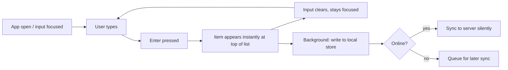
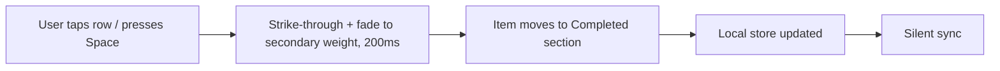
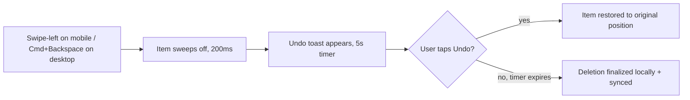
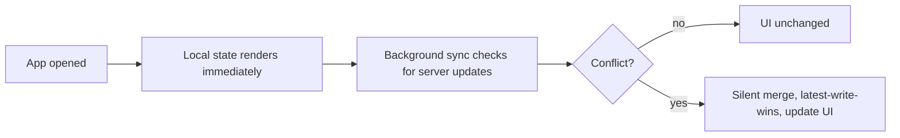
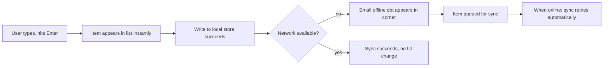

# UX Design Specification bmad-experiment

**Author:** confraria
**Date:** 2026-04-21

---

<!-- UX design content will be appended sequentially through collaborative workflow steps -->

## Executive Summary

### Project Vision

A deliberately minimalist personal todo web app built as the stakeholder's own daily driver. The product is a constraint exercise: no accounts, no priorities, no deadlines, no collaboration — the absence of complexity IS the feature. The experience must feel instantaneous, crafted, and unmistakably built for its user, with mobile web as the primary usage context and desktop as a peer, not a fallback.

### Target Users

Single stakeholder (confraria) dogfooding as both designer and end user. Tech-savvy, expects polish, will use the app multiple times daily, predominantly on mobile phone (commuting, in-line, between tasks) with frequent desktop sessions as well. High tolerance for opinionated UX; zero tolerance for friction, clutter, or "Settings-app" feel.

Implied archetype for future extension: anyone who has rejected Todoist for feature bloat and Apple Reminders for visual noise, wanting a todo tool that feels more like a note-taking app than a project manager.

### Key Design Challenges

1. **Minimalism without emptiness.** Removing features is trivial; making "nothing" feel intentional and warm — rather than unfinished or placeholder-quality — is the actual design work. Empty states, negative space, and typographic rhythm do disproportionate load-bearing.
2. **Mobile-first with true desktop parity.** The PRD demands identical functional experience across devices, but the *primary* device is a 5-inch screen held one-handed while distracted. Mobile constraints must drive the design; desktop inherits and expands, not the other way around.
3. **Instantaneous feel without a backend round-trip penalty.** "Perceived as instantaneous" on a flaky mobile network requires optimistic UI updates, local-first interaction, and transparent error recovery. The PRD's Journey 3 (network failure) is not an edge case — it's a routine Tuesday on a subway.
4. **Active vs. completed distinction without visual competition.** Both states must be legible at a glance, but completed items cannot pull focus from the living list. Typographic weight, color, and motion are the tools; a checkbox alone is not enough.

### Design Opportunities

1. **Typography and spacing as the entire design system.** With no categories, tags, priorities, or metadata, type and space carry 100% of the information hierarchy. A chance to ship a product where the typography *is* the brand.
2. **Craft-level micro-interactions.** Every swipe, tap, and keystroke is one of ~10 total interactions in this app. Each one deserves polish: optimistic add, satisfying complete, undoable delete, keyboard shortcuts on desktop that feel designed-for-power-users.
3. **Resilience as a trust moment.** A todo app that never loses your input — even when offline, even on a flaky network, even if the tab crashes — earns disproportionate user loyalty. Treat offline/error paths as first-class features, not fallbacks.
4. **Reference-grade polish on a small surface.** The scope is small enough to reach "every pixel intentional." This is a portfolio-quality opportunity: a product small enough to actually finish well.

## Core User Experience

### Defining Experience

The core experience is **capture-and-forget on mobile, survey-and-triage on desktop.** The single most important action is *adding a todo* — because a todo app that isn't frictionless to add to will never be used. The second most important action is *opening the app and trusting what you see* — state legibility at a glance. Everything else (complete, delete, edit) must feel crafted but is secondary in frequency and in risk.

The app is not a project manager, a note-taking tool, or a calendar. It is a fast, opinionated capture surface for tasks the user already knows they need to do.

### Platform Strategy

- **Primary:** Mobile web (iOS Safari, Chrome Android), held one-handed, often with divided attention (walking, commuting, in line).
- **Peer:** Desktop web (Chrome, Safari, Firefox), mouse and keyboard, used for sessions rather than glances.
- **Installability:** Ship as a PWA from day one — installable to home screen, standalone display mode (no browser chrome), custom launch icon, splash screen. Treat the installed-to-home-screen state as the canonical experience, not an enhancement.
- **Offline:** First-class. Local-first storage (IndexedDB or similar) with background sync. All CRUD operations succeed locally and reconcile when connectivity returns. The network is an optimization, not a dependency.
- **Touch and keyboard are peers.** Touch interactions (tap targets ≥ 44px, swipe gestures, thumb-reachable primary actions) are designed mobile-first. Desktop inherits the mobile layout and adds keyboard-shortcut power on top — not the other way around.
- **Dark mode is default-equal.** System-preference-following, with both light and dark modes designed and polished to the same quality bar. Dark mode is not a "theme option" — it is the primary mode for mobile subway use.

### Effortless Interactions

- **Adding a todo.** Single tap to focus input on mobile; always-visible persistent input on desktop. Enter to submit. Zero modal, zero confirmation, zero friction. Text appears in list instantly (optimistic), persists locally, syncs in background.
- **Marking complete.** Single tap on the item (not a tiny checkbox) on mobile. Space bar or Enter on desktop when focused. Subtle, satisfying motion — no modal, no sound.
- **Deleting.** Swipe-left on mobile. Keyboard shortcut (cmd/ctrl+backspace) on desktop. Always undoable via transient toast/snackbar for at least 5 seconds.
- **Re-opening the app.** Launches directly into the list. No splash, no "welcome back," no sync spinner blocking content — last known state renders immediately, sync happens in the background.
- **First-time use.** No onboarding. The empty state is the tutorial: a single visible input field with placeholder "Add a task…" and nothing else on screen.

### Critical Success Moments

- **First add, first session.** User opens the app for the first time and adds a todo in under 3 seconds without reading anything. If this fails, the product fails.
- **Return-session trust.** User reopens the app days later on a different device and their data is there, exactly as they left it. If this fails even once, the app is dead.
- **Network failure during add.** User types a todo on a flaky mobile connection. The todo appears in the list instantly, persists locally, and does not disappear or lose their text under any failure condition. This is the PRD's Journey 3 — treat it as a core flow, not an edge case.
- **Glanceable state.** User opens the app mid-day and in under 1 second knows what's active vs. completed without reading any label. Typography, weight, and spacing carry this — no "Active" / "Completed" section headers required in the primary view.
- **One-handed mobile use.** All primary actions (add, complete, delete) are reachable with one thumb on a 6" phone held in either hand.

### Experience Principles

1. **Capture before clarity.** Getting a todo into the app must be faster than reasoning about it. No categories, no priority pickers, no due-date modals in v1 — just text in, list updated.
2. **Local-first, network-optional.** Every interaction must succeed without a round trip. The network is a sync layer, never a blocker.
3. **Typography does the work.** With no chrome, no icons-for-icons-sake, no category chips — type, weight, color, and space carry the entire information hierarchy.
4. **Mobile sets the bar; desktop adds power.** Design decisions are made at 375px wide with a thumb. Desktop gets keyboard shortcuts and density on top, never the inverse.
5. **Every interaction is designed.** There are ~10 total interactions in this app. Each one — add, complete, delete, undo, empty state, error state, offline state, install, first-open, return-open — deserves craft-level attention. None are "minor."
6. **Nothing auto-disappears without undo.** Destructive actions are recoverable for at least 5 seconds. Accidental deletes are a trust-breaker.

## Desired Emotional Response

### Primary Emotional Goals

The dominant emotional target is **quiet confidence.** Not delight, not excitement, not whimsy — those are the emotional registers of novelty products. This product is built to become a habit, and habits are built on trust, calm, and the subconscious feeling that *this just works*. The app should feel like writing in a good notebook: respectful of your attention, never performing, never interrupting.

The product succeeds when the user stops noticing it — when adding a todo is as automatic as breathing, and the interface fades into the background of their day.

### Emotional Journey Mapping

- **First open:** "Oh — that's nice." A quiet, understated first impression. No splash branding, no onboarding tour, no "Welcome!" modal. The design does the introducing.
- **First add:** "That was fast." Subconscious. The user should not consciously notice they added a todo — the action should feel like extension of thought.
- **Completing a task:** "Done." A small, satisfying beat — subtle motion, quiet color shift — but never a celebration, never confetti, never a sound.
- **Returning to the app (hours or days later):** "Everything's where I left it." Trust, reconfirmed. This is the most frequent emotional moment in the lifecycle of the product and the one that earns daily-driver status.
- **Error or network failure:** "OK, it's handling it." Never panic, never a red banner, never "something went wrong." The app communicates calmly and preserves the user's work without drama.
- **Cleaning up / deleting:** "Phew." Small relief. Destructive actions feel safe (undoable), so they feel light.

### Micro-Emotions

The micro-emotions most critical to this product's success, in priority order:

1. **Trust vs. skepticism.** Above all else. The user must believe their data will be there, uncorrupted, every time, forever. One loss of data breaks this permanently.
2. **Confidence vs. confusion.** Every state must be legible in under one second. No ambiguous icons, no hidden affordances that require discovery.
3. **Satisfaction vs. delight.** Satisfaction is the quiet cousin of delight — built through polish and consistency, not surprise. This product should feel *well-made*, not *fun*.
4. **Relief vs. accomplishment.** The emotional reward of checking something off is not "I won!" — it's "that's out of my head now." Design accordingly.
5. **Calm vs. anxiety.** The list must never feel like a guilt pile. Completed items recede visually so the active list stays emotionally light, not accusatory.

### Design Implications

- **Quiet confidence → restrained motion.** Animations are short (150–250ms), eased, purposeful. No bounces, no springs for their own sake, no decorative motion. Every animation signals a state change; none perform.
- **Trust → visible persistence, invisible networking.** Local-first operations succeed without spinners or loading states. The user never sees "Saving…" for an action that completed. Network failures are handled silently in the background; only a passive indicator (e.g., a small offline dot) communicates state.
- **Calm → restrained palette and typography.** One accent color, used sparingly. A generous type scale with room to breathe. Dark mode that's genuinely dark (not gray-on-gray). No gradients, no shadows-as-decoration.
- **Satisfaction → one well-designed moment per interaction.** Adding: text slides in from the input. Completing: subtle strike-through + fade to secondary weight. Deleting: swipe-away + toast undo. Each moment is singular — no competing micro-interactions.
- **Relief → completed items recede.** Completed todos shift to a secondary visual weight (lighter color, strike-through, collapsed into a footer section on desktop or below-the-fold on mobile). The active list is always the emotional center.
- **Avoidance of overwhelm → ruthless defaults.** No badge counts. No streak counters. No "You have N tasks!" banners. Ever.

### Emotional Design Principles

1. **Quiet over loud.** Celebrations and confirmations must earn their place or be cut. When in doubt, remove the flourish.
2. **Relief beats delight.** The product succeeds when users *forget* it — when it becomes part of their day, not a moment in it.
3. **Trust is built through small consistencies.** Every tiny interaction that "just works" compounds into trust. One inconsistency erodes it.
4. **Never startle.** No unexpected modals, no notifications, no color flashes, no auto-scroll, no content jumps. Predictability is a feature.
5. **Silence is a feature.** Empty states, pauses, and blank space communicate calm. Fill them with polish, not content.
6. **Respect emotional load.** The user opens this app when they already have too much to remember. The interface must never add to that weight — it must remove from it.

## UX Pattern Analysis & Inspiration

### Inspiring Products Analysis

**Things 3 (Cultured Code)** — the reference standard for polished personal task management.
- *Does well:* Typographic hierarchy carrying information (no chips, no icons-as-decoration). The "Magic Plus" floating capture button that glides into position for context-aware add. Generous whitespace that makes lists feel calm rather than cluttered. The "Logbook" pattern — completed items recede but remain inspectable. Short, eased, purposeful motion.
- *Why it works:* Respects the user's attention. Feels expensive because of restraint, not ornamentation.

**TeuxDeux** — web-first minimalism, proof that a todo app on the web can be beautiful.
- *Does well:* Calm typographic rhythm. Embraces whitespace. Demonstrates that "just a list" can be enough when type is doing its job.
- *Why it works:* Confidence in the constraint. Doesn't apologize for simplicity.

**Linear** — not a todo app, but the gold standard for interaction feel in a modern web product.
- *Does well:* Every keystroke, click, and transition feels engineered. Optimistic UI throughout (actions succeed instantly, sync is invisible). Keyboard shortcuts that feel designed for power users without looking intimidating. Motion that is short (150–250ms), eased, and always communicating a state change. Dark mode that's genuinely dark.
- *Why it works:* Treats interaction craft as a first-class product feature, not a polish pass.

**iA Writer** — typography-first minimalism, a tool that treats the interface as a frame for content.
- *Does well:* The discipline of "nothing on screen that isn't serving the task." Typography as the primary design system. Feels premium because every decision has been made deliberately.
- *Why it works:* Proves that restraint, executed well, reads as quality.

### Transferable UX Patterns

**Navigation**
- **Single-surface, zero-navigation app.** Like Things' primary view or iA Writer's single canvas — this product has one screen. No tabs, no hamburger menu, no sidebar. If we ever feel the need to add navigation, we've lost the plot.

**Interaction**
- **Persistent capture surface.** Desktop: always-visible input field pinned at top (TeuxDeux). Mobile: floating action button or persistent bottom input bar (Things Magic Plus adapted for web).
- **Tap-anywhere-to-complete, not tiny-checkbox.** The entire row (or the text) is the hit target on mobile. Checkboxes are visual indicators, not the primary affordance.
- **Swipe-to-delete with undo toast.** Standard iOS pattern (Mail, Messages). Undo window ≥ 5 seconds.
- **Optimistic UI with invisible sync.** Every action succeeds locally and instantly; network is a background concern (Linear's model).
- **Keyboard-first power on desktop.** j/k to navigate, Enter to add, Space to toggle complete, cmd/ctrl+Z to undo, cmd/ctrl+Backspace to delete. Shortcuts are not documented in a modal — they're discoverable via a simple `?` help overlay (Linear).

**Visual**
- **Type-driven hierarchy.** Active vs. completed distinguished by weight and color, not chrome. Section separation by space, not lines.
- **One accent color, used sparingly.** Reserved for the primary action (the "add" input on focus, or the current focused row). Everything else is neutral.
- **Completed items recede, never disappear.** Secondary visual weight (lighter, strikethrough). On mobile, collapsed into a disclosed "Completed" section below the active list; on desktop, quietly below the fold.
- **Dark mode genuinely dark.** Near-black backgrounds, not gray-on-gray. Both modes polished to the same quality bar.

**Motion**
- **Short, eased, purposeful.** 150–250ms, standard easing, every animation communicates a state change.
- **Items animate from their source.** A new todo slides from the input position into the list; a deleted todo sweeps off in the direction of the swipe.
- **No spring, no bounce, no decorative motion.** Motion signals; it does not perform.

### Anti-Patterns to Avoid

**From competitor analysis — explicitly reject these:**

- **Apple Reminders' visual noise.** Competing circle checkboxes and row dividers, list-of-lists complexity, iOS-Settings-chrome aesthetic. We want one list, not "Lists."
- **Todoist's gamification.** Karma points, streaks, badges, productivity stats, "level up" notifications. Our product does not reward; it supports.
- **Generic web-app patterns:**
  - Loading spinners for local actions ("Saving…" on an action the user just completed).
  - "Sync in progress" banners or modal overlays.
  - Content layout shifts when data arrives.
  - Hamburger menus, nav drawers, or tab bars for a single-screen app.
- **Onboarding tours, welcome modals, empty-state tutorials.** The empty state is the tutorial. A single input field says "Add a task…" and that is enough.
- **Notifications of any kind in v1.** No push, no email, no in-app badges, no "You have N tasks" counters. The app is used when the user opens it, never before.
- **Confirmation modals on any action.** Deletes are undoable; that's the safety net. Modals are friction; friction kills daily-driver status.
- **Pro nag screens, trial prompts, account prompts.** This product has no accounts, no premium tier, no monetization surface. Every pixel serves the task.
- **Auto-categorization, AI suggestions, "smart" features.** Our product's intelligence is its restraint. No AI, no heuristics, no "suggested tasks."
- **Completed-item auto-archive without undo.** Completed items remain visible and recoverable indefinitely. Nothing disappears on its own.

### Design Inspiration Strategy

**Adopt directly:**
- **Linear's motion language** (150–250ms, eased, state-change-only) as a hard constant across every animation.
- **Linear's optimistic UI discipline** as an architectural requirement: every mutation must succeed locally and instantly.
- **Things 3's Logbook concept** — completed items recede into a secondary section rather than disappear.
- **iA Writer's typographic discipline** — type hierarchy carries information; chrome is minimal to nonexistent.
- **TeuxDeux's confidence in constraint** — no apologies for simplicity; no feature-teaser for "coming soon."

**Adapt:**
- **Things' Magic Plus button** → mobile floating "+" that defaults to focus-input-immediately-on-tap (no context picker; we have no contexts).
- **Things' multi-section view** (Today / Upcoming / Areas) → simplified to just two visual zones: **Active** and **Completed** (the latter secondary-weight, disclosed or below-fold).
- **Linear's keyboard shortcuts** → a curated minimal set (j/k, Enter, Space, cmd+Z, cmd+Backspace, `?`) rather than Linear's full power-user surface.

**Explicitly reject:**
- **Things' and Todoist's project/area/tag hierarchies.** One list only. If v2 ever adds tags, they're a future concern, not an architectural consideration for v1.
- **Linear's command palette.** Overkill for ~10 total interactions. A `?` shortcut help overlay is sufficient.
- **TeuxDeux's date-grid layout.** We have no time dimension in v1 — no days, no deadlines, no recurrence.
- **Apple Reminders' entire chrome language.** No list dividers, no iOS-settings feel, no competing checkboxes.

## Design System Foundation

### Design System Choice

**Tailwind CSS + headless component primitives (Radix UI or shadcn/ui).** A themeable foundation — not an opinionated visual system like Material or Ant. The visual language is hand-built; the primitives give us accessibility, focus management, and keyboard handling for free.

### Rationale for Selection

- Opinionated visual systems (Material, Ant) would fight the "quiet, typographic" direction we committed to in steps 2–5.
- A pure custom system costs time we don't need to spend — the surface is tiny (~5 components).
- Tailwind + Radix gives us design tokens, utility-level control over typography and spacing, and WAI-ARIA-compliant primitives (dialog, checkbox, toast) without dictating look.
- Single-developer project — no team to align on a heavier system.

### Implementation Approach

- Design tokens in a single CSS/Tailwind config file (color, type scale, spacing, motion constants).
- Radix/shadcn primitives for: focusable list items, checkbox semantics, toast (undo), dialog (if ever needed).
- Hand-rolled components on top: `TodoItem`, `TodoList`, `AddTodoInput`, `UndoToast`, `EmptyState`, `OfflineIndicator`.
- Motion via Framer Motion or CSS transitions — kept to the 150–250ms constant set in step 5.

### Customization Strategy

- Zero reliance on Tailwind's default palette — define our own neutral scale and a single accent.
- Override Tailwind's default spacing scale with a narrower, type-first rhythm (based on line-height, not 4px grid).
- No icon library by default. If an icon is ever needed (swipe hint, offline indicator), use Lucide for consistency.

## Defining Core Experience

### Defining Experience

**"Type a thought, hit Enter, forget it."** The defining interaction is capture — frictionless, instant, trustworthy. If adding a todo doesn't feel like an extension of thought, the product fails regardless of how polished everything else is.

### User Mental Model

The user approaches the app like a scratchpad or a fast note-taking surface — not like a productivity tool. They expect: input is always ready, text goes in, text stays in, no setup, no categories, no "where does this go?" moment. Existing mental model comes from Apple Notes, iA Writer, or pen-and-paper — not from Todoist or Things.

### Success Criteria

- Time from "I need to remember this" to "it's saved" is under 3 seconds on mobile.
- User adds their first todo on first open without reading any UI text other than the placeholder.
- User never sees a spinner, loading state, or confirmation modal for an add action.
- User trusts the app enough after 1 week to stop double-checking that their todos persisted.

### Novel UX Patterns

Nothing novel. This product succeeds by executing established patterns (text input + list + check/delete) at a craft level higher than competitors. Novelty is a risk, not a feature.

### Experience Mechanics

- **Initiation:** Mobile — tap anywhere on the persistent bottom input or the floating "+" (same surface). Desktop — always-focused input at top of list, or `N` shortcut to focus from anywhere.
- **Interaction:** Type text. Enter submits. Text appears at the top of the active list instantly (optimistic). Input clears and retains focus. No modal, no "Save?" prompt, no confirmation.
- **Feedback:** Item slides into the list from the input position (150ms). Input clears. That's it. No success toast, no haptic on desktop, subtle haptic on mobile where supported.
- **Completion:** The task is *added* — user can immediately type the next one. No "done" state for the add action itself; the list is the receipt.

## Visual Design Foundation

### Color System

- **Neutral scale:** 10 steps from near-white (#FAFAFA) to near-black (#0A0A0A). Hand-tuned, not Tailwind default grays.
- **Accent:** One color, used sparingly — focused input underline, current-focus row indicator on desktop. Proposed: a muted warm amber (#D97706) for light mode, a brighter amber (#FBBF24) for dark. Never used for backgrounds, never for icons.
- **State colors:** None by default. Errors are communicated via copy, not red. Offline state via a single neutral dot.
- **Dark mode:** True dark — background #0A0A0A (near black). No gray-on-gray. Contrast targets AA minimum, AAA where typography allows.

### Typography System

- **Typeface:** System font stack (Inter as web-loaded fallback if system rendering is insufficient). Reasoning: fastest load, native feel, no FOUT.
- **Type scale:** 4 sizes only.
  - `text-xs` 13px — timestamps, offline indicator, help overlay.
  - `text-base` 16px — todo item body (active).
  - `text-lg` 18px — input field text.
  - `text-xl` 20px — completed section header (desktop only).
- **Weights:** Regular (400) for active items; Regular + 60% opacity or light gray for completed. No bold, no semi-bold. Weight changes are reserved for focus states.
- **Line-height:** 1.5 for body, 1.3 for input. Generous.

### Spacing & Layout Foundation

- **Vertical rhythm:** Based on line-height, not a 4px grid. Items separated by ~1.5x line-height of whitespace, not divider lines.
- **Horizontal padding:** 24px on mobile, 32–48px on desktop. Generous margins — the list breathes.
- **Max content width:** ~600px on desktop. Centered. The list is always a reading width, never edge-to-edge.
- **Touch targets:** Min 44x44px on mobile — entire row is the hit target.

### Accessibility Considerations

- Contrast AA minimum across all text + state combinations in both light and dark modes.
- Focus indicators are visible and use the accent color — never "outline: none" without a replacement.
- Full keyboard operability on desktop; VoiceOver/TalkBack support on mobile (Radix primitives handle ARIA).
- Semantic HTML: `<ul>` + `<li>` for the list, `<button>` for complete/delete, `<input type="text">` for add.
- Respects `prefers-reduced-motion` — all motion falls back to instant transitions.

## Design Direction Decision

### Design Directions Explored

- **Direction A — Editorial minimalism (iA Writer + TeuxDeux):** Typography-driven, generous space, monotone.
- **Direction B — Tool-like polish (Linear + Things 3):** Crisp interactions, subtle motion, muted accent, one-screen feel.
- **Direction C — Native-app mimicry (Apple Reminders / iOS):** Platform-native chrome. Rejected in inspiration analysis.

### Chosen Direction

**Hybrid of A + B.** Visual language from Direction A (editorial typography, deep negative space, restraint). Interaction language from Direction B (craft-level motion, keyboard-first on desktop, optimistic UI). Direction C is explicitly rejected.

### Design Rationale

- Direction A alone risks feeling static / document-like; we need the interactive polish of B to feel modern.
- Direction B alone risks feeling corporate / tool-y; we need A's warmth and restraint.
- The combination matches the emotional target (quiet confidence) and the core experience target (capture as extension of thought).

### Implementation Approach

- Start all design decisions from Direction A's "is this necessary?" lens.
- Layer Direction B's motion and keyboard conventions as the interaction vocabulary.
- When in doubt, cut. Restraint is the direction.

## User Journey Flows

### Journey 1 — Capture (core flow)

### Journey 2 — Complete

### Journey 3 — Delete with undo

### Journey 4 — Return session

### Journey 5 — Network failure during add

### Journey Patterns

- **Optimistic-first.** Every journey begins with a local-state write; network sync is always a background concern.
- **No blocking UI.** No journey contains a spinner, loading state, or modal. Nothing ever waits on the network.
- **Undo-reachable.** Any destructive action has a ≥5s undo window before finalization.
- **Silent recovery.** Error paths do not surface alerts; they degrade into passive indicators (offline dot) and recover automatically.

### Flow Optimization Principles

- If a flow requires more than one tap / keystroke to complete for the common path, the flow is wrong.
- If a flow surfaces a loading state for local data, the flow is wrong.
- If a flow requires the user to make a decision the app could make silently, the flow is wrong.

## Component Strategy

### Design System Components

From Radix UI / shadcn primitives:
- `Checkbox` (semantics only; visual is custom).
- `Toast` (for undo).
- `Dialog` (reserved; likely unused in v1).

### Custom Components

- **`AddTodoInput`** — persistent input surface. Mobile: bottom-pinned bar. Desktop: top of list.
- **`TodoItem`** — full row. Entire row is tap target. Renders text + implicit checkbox state. Handles swipe gesture on mobile, keyboard focus on desktop.
- **`TodoList`** — ordered list with two visual zones: Active (primary weight) and Completed (secondary weight).
- **`UndoToast`** — transient bottom toast with "Undo" action, 5s auto-dismiss.
- **`EmptyState`** — shown when no todos exist. Just the input and placeholder text. No illustration, no "Welcome!" copy.
- **`OfflineIndicator`** — single neutral dot in a corner when offline. No banner.
- **`HelpOverlay`** — desktop-only, triggered by `?`. Lists keyboard shortcuts. Simple modal, dismissable with Escape.

### Component Implementation Strategy

- Every custom component consumes design tokens (color, type, spacing, motion) — no hardcoded values.
- All components render usefully on the server (SSR-safe) for fast first paint.
- Motion is encapsulated per-component; no global animation orchestration.
- Components are pure — state lives above them in a local store (e.g., Zustand, Jotai) that mirrors IndexedDB.

### Implementation Roadmap

- **Phase 1 — Core (blocks MVP):** `AddTodoInput`, `TodoItem`, `TodoList`, `EmptyState`.
- **Phase 2 — Safety (required for trust):** `UndoToast`, `OfflineIndicator`.
- **Phase 3 — Polish:** `HelpOverlay`, refined motion, haptics on mobile where supported.

## UX Consistency Patterns

### Button Hierarchy

- **Primary:** None. The add input is the only "primary" surface and it's not a button.
- **Destructive:** Swipe / keyboard shortcut only. Never a visible delete button in the default state.
- **Ghost/text:** Undo (in toast), Help trigger (`?` indicator). Muted, never demanding attention.

### Feedback Patterns

- **Success:** Implicit — the mutation is visible instantly in the list. No success toasts.
- **Error:** Never modal. Failed sync shows the offline dot + retains local write; nothing is ever "lost" from the user's perspective.
- **In-progress:** Never shown for local operations. Network sync is always background.

### Form Patterns

Only one form: the add-todo input.
- Single-field, single-line.
- Placeholder: "Add a task…"
- Enter submits. Shift-Enter inserts newline if the input ever supports multiline (not in v1).
- Empty submit is a no-op (no error, no flash).

### Navigation Patterns

None. The app is a single screen. No tabs, no routes in v1, no nav drawer.

### Additional Patterns

- **Undo toast:** 5s auto-dismiss, bottom-center on mobile, bottom-left on desktop. One action, no close button (auto-dismisses).
- **Help overlay (desktop):** triggered by `?`, lists shortcuts, dismissable by Escape or clicking outside.
- **Offline dot:** 6x6px neutral dot, top-right corner, no label. Appears on network loss, disappears on recovery.

## Responsive Design & Accessibility

### Responsive Strategy

Mobile-first, always. Design decisions are made at 375px wide with one-thumb reach; desktop inherits and adds density + keyboard power.

### Breakpoint Strategy

- **Mobile:** 320–767px — primary design target. Bottom-pinned input. Swipe gestures. Single column.
- **Tablet:** 768–1023px — mobile layout, slightly wider max-width (but still capped at ~600px reading width).
- **Desktop:** 1024px+ — top-pinned input. Keyboard shortcuts fully active. Help overlay available. Content still capped at ~600px centered — we do not expand to fill.

### Accessibility Strategy

- **WCAG 2.1 AA baseline** across both light and dark modes.
- **Keyboard:** full operability. Tab order follows visual order. `?` opens help. All actions reachable without a mouse.
- **Screen reader:** semantic HTML + ARIA labels on icon-only controls (none in v1). Radix primitives handle ARIA for checkbox/toast.
- **Touch targets:** 44x44px minimum.
- **Motion:** `prefers-reduced-motion` honored — transitions fall back to instant.
- **Color:** never the sole signal for state. Completed state uses strikethrough + weight reduction, not just color.
- **Zoom:** text-based layout reflows cleanly to 200% zoom without horizontal scroll.

### Testing Strategy

- **Responsive:** test on real iPhone (Safari) + Android (Chrome) at minimum. Lighthouse mobile audit in CI.
- **Accessibility:** axe-core in CI. Manual VoiceOver pass before each release. Keyboard-only pass on desktop.
- **Cross-browser:** latest Chrome, Safari, Firefox on desktop; iOS Safari and Chrome Android on mobile. No IE, no legacy Edge.
- **Offline:** manual test — disable network mid-session, verify all CRUD still succeeds and syncs on recovery.

### Implementation Guidelines

- Use relative units (`rem`) for type and spacing.
- Mobile-first media queries — base styles target 375px, queries layer up.
- Semantic HTML first; add ARIA only where semantic HTML is insufficient.
- Focus management: on mobile, tapping a row does not move keyboard focus; on desktop, row navigation with j/k moves visual focus and aria-activedescendant.
- Test with actual devices, not just emulators — touch feel cannot be validated in DevTools.
- CI runs Lighthouse (mobile + desktop) and axe on every PR; fail on any regression below threshold.
